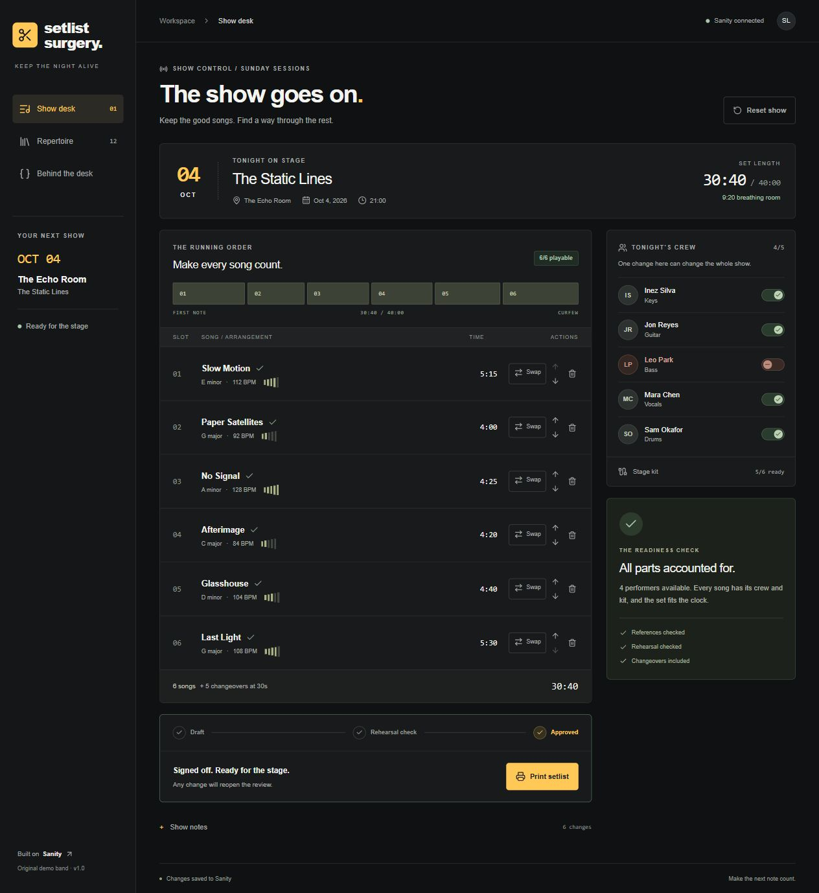

# Setlist Surgery

A bassist cancels. Three songs stop being playable. Rescue the running order using arrangements that fit the available performers, instruments, rehearsal status, and venue clock, then rehearse and approve the exact set.

Built with Next.js, React, and Sanity for the [Sanity Challenge, Path Two](https://dev.to/challenges/sanity-2026-09-16). The Static Lines, their crew, and all twelve song arrangements are original fictional demonstration data. No audio or lyrics are included.

[Try the live app](https://setlist-surgery.vercel.app/). No account is required; changes save to Sanity.



## Run locally

Use Node.js 24.

```sh
npm ci
npm run dev
```

Open `http://localhost:3000`. Without Sanity configuration, the app runs an explicitly labelled local demo. Demo state is independent per tab, survives reload, and clears when the tab closes.

To use Content Lake, copy `.env.example` to `.env.local` and fill in the server token:

```dotenv
SANITY_PROJECT_ID=raaqr2vc
SANITY_DATASET=setlist_surgery
SANITY_API_TOKEN=your-server-token
```

The configured project already has the 25 catalogue documents. For a new dataset, run `npm run seed`. The seed uses `createIfNotExists`; reruns preserve existing records. The live badge says **Sanity connected**. Incomplete configuration and remote failures remain visible instead of silently switching to demo mode.

## Deploy on Vercel

Import [KAMEVETRICS/setlist-surgery](https://github.com/KAMEVETRICS/setlist-surgery) into Vercel with these settings:

| Setting | Value |
| --- | --- |
| Framework | Next.js |
| Root directory | Repository root |
| Node.js | 24.x, specified in package.json |
| Install command | `npm ci` |
| Build command | `npm run build` |
| Output directory | Next.js default |

Add `SANITY_PROJECT_ID`, `SANITY_DATASET`, and `SANITY_API_TOKEN` in Vercel's environment settings for the environments that need live Sanity. Mark the token sensitive, keep it server-only, and deploy after setting the variables. Do not use a `NEXT_PUBLIC_` prefix for the token. The app's browser talks to its own `/api/show`; Sanity requests originate on the server.

The [live Vercel deployment](https://setlist-surgery.vercel.app/) was verified against the real Sanity dataset: cancellation, replacements, rehearsal, approval after reload, stale-write rejection, edit invalidation, and origin protection all passed. For another deployment, verify the connection badge and the rescue flow after configuring its environment.

See the [Vercel Next.js guide](https://vercel.com/docs/frameworks/full-stack/nextjs) and [environment variable settings](https://vercel.com/docs/environment-variables).

## Try the rescue

1. Reset the show and choose **Bassist cancelled**. Night Drive, Static Bloom, and Neon Weather become blocked.
2. Replace them with Slow Motion, No Signal, and Glasshouse respectively.
3. The six-song set is **30:40**, including five 30-second changeovers, with **9:20** remaining in the venue's 40-minute slot.
4. Choose **Check rehearsal**, then **Approve set**. Live approval persists after reload. A reorder or changed requirement returns the effective review to Draft.
5. Print the approved setlist, search/add repertoire, or change stage-kit availability to try another scenario.

## Sanity Studio

The optional `studio/` app contains the reference schemas. Install its dependencies with `npm ci`, copy `studio/.env.example` to `studio/.env.local`, set the public project ID/dataset, and run `npm run dev` from that directory. Publish Studio edits for the app to see them.

Songs reference performers and instruments; shows reference songs and a venue. Rescue sessions store their running order, availability overrides, review state, and history. The API uses server-issued HttpOnly cookies, known commands, same-origin writes, and `ifRevisionID` to reject stale changes.

The `ss.*` document IDs require authenticated readers under [Sanity's namespace rules](https://www.sanity.io/docs/content-lake/ids), even with public dataset visibility. The backend supplies its server token. Project ID `raaqr2vc` is provided for challenge judging. This demonstration is not intended for sensitive data.

## Verify

```sh
npm test
npm run typecheck
npm run build
```

`lib/engine.ts` holds the pure readiness and review rules; `lib/show-service.ts` handles restricted session commands; `lib/sanity.server.ts` holds GROQ and mutations. AI assisted design, implementation, and debugging; replacement eligibility at runtime uses visible deterministic rules. The review stages are this app's state machine; Sanity's Workflows product and App SDK are not implemented.

The [build journal](docs/build-journal.md), [verification record](docs/verification.md), and [DEV draft](docs/dev-submission.md) describe actual results and remaining submission steps. Generated output, local credentials, unused starter components, database examples, and Sites/Cloudflare adapters are omitted from this repository.

## License

[MIT](LICENSE).
